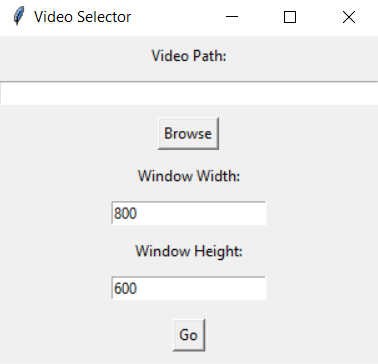

# Video Frame Viewer 1.0

This is a simple tool for stepping through a video frame by frame and saving individual frames.

## Video selection window

When you run the `.exe`, the first window lets you choose a video file.

- Use the **Video Path** field to paste the file path, or click **Browse** to select one.
- **Window Width** and **Window Height** let you set the size of the viewer window. If you're not sure, just leave the default values (800x600).
- Click **Go** to open the main video viewer.

First window

## Frame scrubbing

In the main window, you can move through the video manually.

- This is not a media player — frames don’t play automatically.
- Set how many frames to skip using the **Number of frames** field.
- Use **Next** and **Previous** buttons to move forward or backward.
- You can also jump to a specific time by entering seconds (e.g. `12.500`) into the **Time** field and hitting **Enter**.

Second window
)

## Saving frames

Click **Save Frame** to export the current frame as a `.png`.

It will be saved in the same folder as the `.exe`, with a name like `frame_time.png`.

## Exiting the program

Just close the window. That’s it.
